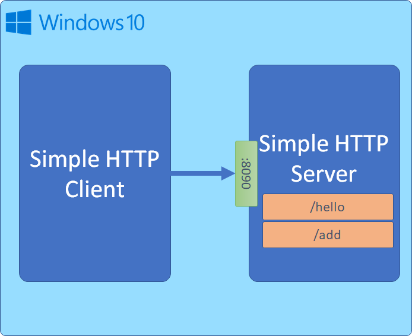
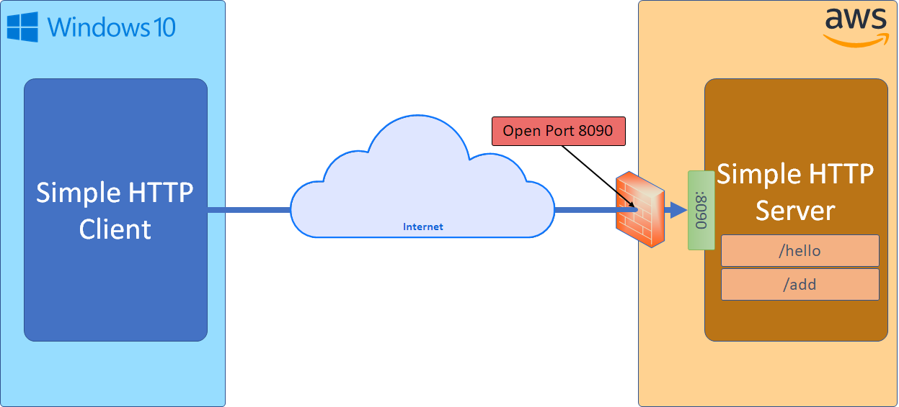
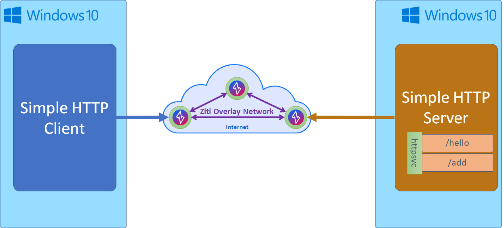

# HTTP

This exercise takes a simple server listening on a port. The example is contrived and simple on purpose. When deploying
locally the basic setup would look like this:

When deploying a server like this out to the internet, for example using AWS, that same basic overview would 
probably look more like this simplified diagram below. Notice that port 8090 is now open through the firewall. The 
server is also listening on port 8090.

With Ziti you can eliminate the need for listening ports, the need for firewall holes in you deployments entirely. 
This is what the same example looks like using Ziti. Notice no inbound firewall ports needed on either side. No 
listening port at all in the zitified example, just a Ziti service which is "bound" to the server identity

